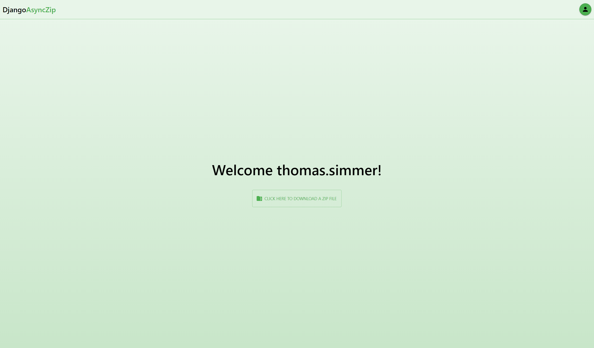

# DjangoAsyncZip

DjangoAsyncZip is a demo project to show how to serve big zip files asynchronously while being memory efficient and using Django Rest Framework authentication. It is based on NeoTemplate.

NeoTemplate is a full-stack website template built using Next.js with Material UI, NextAuth, and i18next for the frontend, and Django with Django Rest Framework (DRF) for the backend. It provides a foundation for creating websites with essential features already implemented, including:

- Email-based sign-in/sign-up
- Email validation
- Password reset functionality
- Profile management with profile picture upload
- A basic home page
- Theme (light/dark) selection (stored client-side)
- Language selection (stored client-side)

<br>

<p align="center">

</p>

## Installation

- Clone the project
- Ensure you have Docker and Docker Compose installed.
- Create `.env` files in the `backend/` and `frontend/` folders and populate them using the respective `.env.template` files.

### Local

```bash
docker-compose up --build
```

### Production

```bash
docker-compose -f docker-compose.prod.yml up --build
```

If Docker encounters permission issues:

```bash
sudo chown -R $(id -u):$(id -g) $HOME/.docker
```

Then navigate to: [http://localhost:3000/](http://localhost:3000/)

## Admin Panel

To access the Django admin panel, create a superuser within your backend container:

```bash
docker exec -it backend bash
python manage.py createsuperuser
```

Then navigate to: [http://localhost:8000/admin/](http://localhost:8000/admin/)

## Run tests

If you have a backend container running:

```bash
docker exec -it backend bash
python manage.py test
```

Otherwise, in your normal terminal:

```bash
python -m venv ".venv"
source .venv/bin/activate
pip install -r requirements
cd backend
export SECRET_KEY='a'
export JWT_SECRET_KEY='a'
python manage.py test
```
